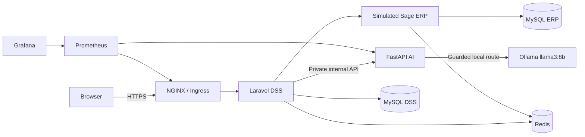

<div align="center">

#  SmartFactory DSS

### AI-powered enterprise decision support for production, maintenance, quality, and industrial observability

[](#project-status)
[](https://laravel.com/)
[](https://fastapi.tiangolo.com/)
[](https://kubernetes.io/)
[](https://prometheus.io/)
[](https://grafana.com/)
[](https://ollama.com/)

</div>

---

##  Overview

**SmartFactory DSS** is an enterprise decision-support prototype designed for a Moroccan juice-manufacturing environment. It combines production monitoring, maintenance prioritization, quality control, secure reporting, machine-learning inference, guarded local LLM explanations, a simulated Sage ERP integration layer, containerized delivery, Kubernetes orchestration, and application/platform observability.

> **Data and safety note:** the current prototype uses simulated ERP/industrial data. It provides human-controlled decision support only; it does not perform autonomous industrial control or claim validated plant-performance guarantees.

---

##  Project status

| Capability | Status |
|---|---|
| Simulated Sage ERP integration |  Complete |
| Production and operational monitoring |  Complete |
| Maintenance and downtime management |  Complete |
| Quality inspections and finished-lot release |  Complete |
| Machine-learning inference and model registry |  Complete |
| Guarded role-aware Ollama explanations |  Complete |
| PDF, Excel, and CSV decision-support reporting |  Complete |
| Authentication, RBAC, 2FA, audit and rate limiting |  Complete |
| Docker Compose and local HTTPS delivery |  Complete |
| Kubernetes / Minikube deployment |  Complete |
| HPA, resource governance and disruption controls |  Complete |
| Prometheus / Grafana monitoring |  Complete |
| Private native Laravel, FastAPI and ERP metrics |  Complete |
| CI/CD-ready validation and deployment workflow |  Complete |

**Current accepted Kubernetes runtime:** 13 ready Pods, 0 active-Pod restarts, 2 HPAs and 17/17 healthy Prometheus targets.

---

##  Main components

| Component | Location | Responsibility |
|---|---|---|
| Laravel DSS | `laravel-app/` | Authentication, RBAC, dashboards, ERP orchestration, reporting, auditing, AI Insights |
| FastAPI AI service | `fastapi-ai/` | Verified ML inference, guarded prompts, grounding validation and safe fallbacks |
| Sage ERP simulator | `sage-erp-simulator/` | Simulated master, production, maintenance and quality data |
| NGINX | `docker/nginx/` | HTTPS entry point, internal routing and private metrics gateway |
| Kubernetes | `deploy/kubernetes/` | Workloads, Services, policies, HPAs, monitoring and local demo access |
| Monitoring | `deploy/kubernetes/monitoring/` | Prometheus, Grafana, kube-state-metrics, blackbox exporter, dashboards and alerts |

---

##  Architecture



### Security boundaries

- The browser never communicates directly with FastAPI or Ollama.
- FastAPI is an internal AI boundary and has no direct access to Laravel or ERP databases.
- Laravel-to-FastAPI requests use authenticated internal contracts and request IDs.
- Native metrics are private; Laravel and ERP metrics are exposed through dedicated internal NGINX routes, while FastAPI metrics accept only the intended private host boundary.
- Runtime Secrets are created outside Git; real `.env` files, databases, datasets, model artifacts, generated archives and backups are excluded from version control.

---

##  AI and machine learning

The platform supports next-day production forecasting, production anomaly scoring, maintenance-risk prioritization, verified model-registry inference, role-aware explanations, strict grounding, hallucinated-number rejection, safe fallbacks, and exact explanation-to-report binding.

```text
Verified inference facts
        ↓
Strict FastAPI contract
        ↓
Private Ollama (llama3:8b)
        ↓
Grounding + safety validation
        ↓
Laravel AI Insights + reports
```

The numeric inference result remains authoritative even when the narrative service is unavailable.

---

##  Manufacturing domain

The simulator models juice-manufacturing families including Valencia Premium, Valencia Essentiel & Classics, Valencia Lacté & Twist, Valencia Ice Tea, and Valencia Juper / Maxi / Abtal / Plaisir.

```text
Pasteurisation → Mixing → Filling → Packaging
```

---

##  Kubernetes runtime

The accepted local Minikube demonstration stack includes 2 Laravel replicas, 2 FastAPI replicas, 1 Sage ERP simulator, 1 NGINX gateway, 2 MySQL StatefulSets, 1 Redis StatefulSet, Prometheus, Grafana, kube-state-metrics, and blackbox exporter. Laravel and FastAPI are governed by two HPAs. Stateful data remains on persistent volumes and is never reset by the validation workflow.

### Local browser access

```text
https://localhost:8443/login
```

---

##  Observability

Phase 12 adds private native application metrics and platform monitoring.

- Laravel native metrics;
- FastAPI native metrics from both replicas;
- simulated Sage ERP native metrics;
- Redis-backed PHP metrics with a fast local-file fallback;
- a dedicated non-persistent `smartfactory_metrics` Redis connection with bounded connect/read timeouts;
- 17/17 healthy Prometheus targets;
- 17 alerting rules;
- **SmartFactory DSS — Kubernetes Overview** (9 panels);
- **SmartFactory DSS — Application Observability** (17 panels).

---

##  Security features

- secure authentication and account controls;
- password policy and password-change workflow;
- TOTP two-factor authentication and recovery codes;
- role-based access control;
- request validation, throttling and rate limiting;
- append-oriented audit logging;
- private internal AI and metrics endpoints;
- secure-session HTTPS configuration;
- encrypted/user-bound explanation snapshots;
- safe failure isolation;
- Kubernetes NetworkPolicies, ServiceAccounts and runtime Secret separation.

---

##  Reporting

Decision-support outputs can be exported as PDF, Excel and CSV. Reports separate verified numeric facts, model metadata/limitations and guarded AI narrative. Export does not silently execute a second prediction.

---

##  Technology stack

| Layer | Technologies |
|---|---|
| Web application | Laravel 12, PHP 8.3, Bootstrap |
| AI service | FastAPI, Python 3.12 |
| Data and cache | MySQL 8, Redis |
| Machine learning | scikit-learn, versioned local model artifacts |
| Local LLM | Ollama with `llama3:8b` |
| Edge / reverse proxy | NGINX |
| Containers | Docker / Docker Compose |
| Orchestration | Kubernetes / Minikube / Kustomize |
| Observability | Prometheus, Grafana, kube-state-metrics, blackbox exporter |
| Testing | PHPUnit, Pytest, Ruff and controlled runtime validators |
| Version control | Git and GitHub |

---

##  Validation strategy

The repository includes source, regression and runtime validation for authentication/authorization, ERP synchronization contracts, production/maintenance/quality workflows, model inference, Ollama grounding/failure isolation, reporting, HTTPS/session behavior, Kubernetes manifests, NetworkPolicies, resource governance, native metrics privacy/performance, Prometheus and Grafana.

Validation is fail-fast and preserves databases, PVCs, Secrets and Git history.

---

##  Repository structure

```text
smartfactory-dss/
├── laravel-app/
├── fastapi-ai/
├── sage-erp-simulator/
├── docker/
├── deploy/
│   ├── compose/
│   └── kubernetes/
├── docs/
├── compose.yaml
├── compose.https.yaml
└── README.md
```

---

##  Deployment documentation

- `deploy/kubernetes/README.md`
- `docs/deployment/kubernetes-https-login.md`
- `docs/deployment/kubernetes-https-assets.md`
- `docs/deployment/kubernetes-monitoring.md`
- `docs/deployment/native-application-metrics.md`

---

##  Prototype limitation

This repository demonstrates engineering architecture and decision-support capabilities with simulated industrial data. Results must not be presented as validated industrial performance, guaranteed production commitments, autonomous maintenance decisions, or a live Sage deployment until the corresponding real-system integration and validation are performed.

---

<div align="center">

**SmartFactory DSS — secure, explainable, observable and human-controlled decision support**

</div>
