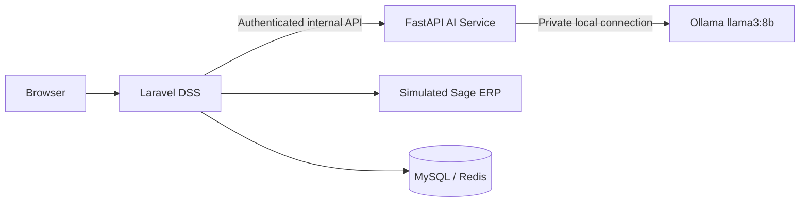

<div align="center">

# 🏭 SmartFactory DSS

### AI-powered decision support for production, maintenance, quality, and reporting

[](#project-status)
[](https://laravel.com/)
[](https://fastapi.tiangolo.com/)
[](https://www.python.org/)
[](https://ollama.com/)

</div>

---

## ✨ Overview

**SmartFactory DSS** is an enterprise decision-support prototype for a Moroccan juice-manufacturing environment. It combines production monitoring, maintenance prioritization, quality control, reporting, machine learning, a simulated Sage ERP, and guarded local AI explanations.

> **Important:** all operational and machine-learning outputs currently use `simulated_prototype` data. The platform provides decision support only and never performs autonomous industrial control.

---

## 📌 Project status

| Area | Status |
|---|---|
| Simulated Sage ERP integration | ✅ Completed |
| Production and operational monitoring | ✅ Completed |
| Maintenance and downtime | ✅ Completed |
| Quality and finished-lot release | ✅ Completed |
| Machine-learning inference | ✅ Completed |
| Guarded role-aware Ollama explanations | ✅ Completed |
| Secure PDF, Excel, and CSV reporting | ✅ Completed |
| Containerization and delivery | 🚧 Phase 8 |

Stable checkpoint: **`phase-7-accepted`**

---

## 🧩 Main components

| Component | Location | Responsibility |
|---|---|---|
| Laravel DSS | `laravel-app/` | Authentication, RBAC, dashboards, ERP sync, reporting, auditing, AI Insights |
| FastAPI AI service | `fastapi-ai/` | Verified model inference, guarded prompts, grounding validation, safe fallbacks |
| Sage ERP simulator | `sage-erp-simulator/` | Simulated master, production, maintenance, and quality data |

---

## 🏗️ Architecture



### Security boundaries

- The browser never communicates directly with FastAPI or Ollama.
- FastAPI has no direct access to Laravel databases or ERP tables.
- Internal requests use bearer-token authentication and request IDs.
- Real `.env` files, databases, datasets, model artifacts, generated archives, and backups are excluded from Git.

---

## 🤖 AI and machine learning

The platform currently supports:

- next-day production forecasting;
- production anomaly scoring;
- maintenance-risk prioritization;
- role-aware explanations for supervisors and managers;
- strict fact allowlists and grounding checks;
- hallucinated-number and unsafe-claim rejection;
- deterministic safe fallback explanations;
- exact explanation-to-report binding.

### Guarded explanation principle

```text
Verified inference facts
        ↓
Strict FastAPI contract
        ↓
Private local Ollama
        ↓
Grounding and safety validation
        ↓
Laravel AI Insights and reports
```

The numeric inference result always remains authoritative.

---

## 🧃 Manufacturing domain

The simulated environment models product families such as:

- Valencia Premium;
- Valencia Essentiel & Classics;
- Valencia Lacté & Twist;
- Valencia Ice Tea;
- Valencia Juper, Maxi, Abtal & Plaisir.

Typical production flow:

```text
Pasteurisation → Mixing → Filling → Packaging
```

---

## 🛠️ Technology stack

| Layer | Technologies |
|---|---|
| Web application | Laravel 12, PHP 8.3, Bootstrap |
| AI service | FastAPI, Python 3.12 |
| Data and cache | MySQL 8, Redis |
| Machine learning | scikit-learn, verified local artifacts |
| Local LLM | Ollama with `llama3:8b` |
| Testing | PHPUnit, Pytest, Ruff |
| Version control | Git and GitHub |

---

## 🔐 Security features

- secure authentication and account controls;
- mandatory password rules;
- two-factor authentication and recovery codes;
- role-based access control;
- request validation and rate limiting;
- append-oriented audit logging;
- private internal AI endpoints;
- encrypted, user-bound explanation snapshots;
- no direct browser-to-Ollama access;
- safe failure isolation when AI services are unavailable.

---

## 📊 Reporting

Verified AI results can be exported as:

- PDF;
- Excel;
- CSV.

Reports clearly separate:

1. verified numeric facts;
2. model metadata and limitations;
3. guarded AI narrative.

No second prediction is executed during export.

---

## 🧪 Testing

The repository includes focused and full regression tests for:

- authentication and authorization;
- ERP synchronization;
- production and maintenance workflows;
- quality and reporting;
- model registry and inference contracts;
- Ollama availability and failure isolation;
- grounding and hallucination controls;
- exact report-to-explanation binding;
- simulated-data classification constraints.

---

## 📁 Repository structure

```text
smartfactory-dss/
├── fastapi-ai/
├── laravel-app/
├── sage-erp-simulator/
├── .gitattributes
├── .gitignore
└── README.md
```

---

## 🌐 Local development endpoints

| Service | Address |
|---|---|
| Laravel DSS | `https://smartfactory-dss.test` |
| FastAPI AI service | `http://127.0.0.1:8001` |
| Ollama | `http://127.0.0.1:11434` |

---

## ⚠️ Prototype limitation

This project is an academic and engineering prototype. Results must not be presented as validated industrial performance, guaranteed production commitments, or autonomous predictive-maintenance decisions.

---

<div align="center">

**SmartFactory DSS — secure, explainable, and human-controlled decision support**

</div>
